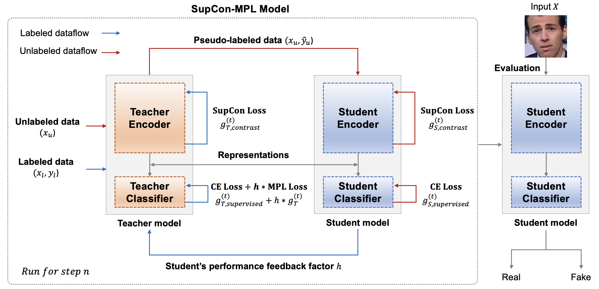
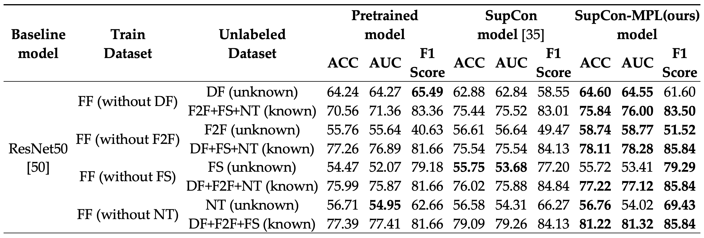
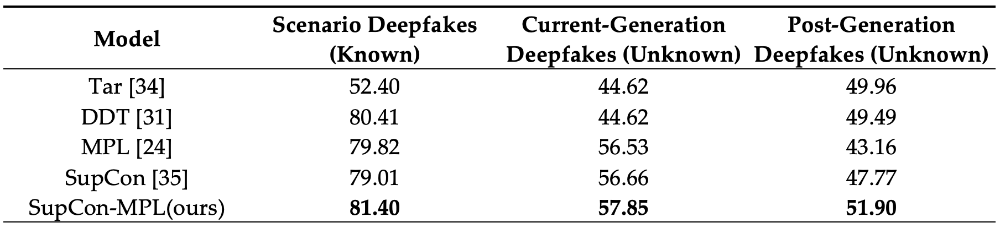

# SupCon-MPL-DP: Supervised Contrastive Learning with Meta Pseudo Labels for Deepfake Image Detection



#### SupCon-MPL-DP: Supervised Contrastive Learning with Meta Pseudo Labels for Deepfake Image Detection

Kyeong-Hwan Moon<sup>1</sup>, Soo-Yol Ok<sup>2</sup> and Suk-Hwan Lee<sup>3,*</sup>

[Github](https://github.com/drmoon-1st/SupCon-MPL.git) / 
[Paper]()

**Abstract** : Recently, there has been considerable research on deepfake detection. However, most existing methods face challenges in adapting to the advancements in new generative models within un-known domains. In addition, the emergence of new generative models capable of producing and editing high-quality images, such as Diffusion, Consistency, and LCM, poses a challenge for tra-ditional deepfake training models. These advancements highlight the need for adapting and evolving existing deepfake detection techniques to effectively counter the threats posed by sophis-ticated image manipulation technologies. In this paper, our objective is to detect deepfake videos in unknown domains using unlabeled data. Specifically, our proposed approach employs Meta Pseudo Labels (MPL) with Supervised Contrastive Learning, so-called SupCon-MPL, allowing the model to be trained on unlabeled images. MPL involves the simultaneous training of both a teacher model and a student model, where the teacher model generates Pseudo Labels utilized to train the student model. This method aims to enhance the adaptability and robustness of deepfake detection systems against emerging unknown domains. Supervised Contrastive Learning utilizes labels to compare samples within similar classes more intensively, while encouraging greater distinction from samples in dissimilar classes. This facilitates the learning of features in a diverse set of deepfake images by the model, consequently contributing to the performance of deepfake detection in unknown domains. When utilizing the ResNet50 model as the backbone, Sup-Con-MPL exhibited an improvement of 1.58% in accuracy compared to traditional MPL in known domain detection. Moreover, in the same generation of unknown domain detection, there was a 1.32% accuracy enhancement, while in the detection of post-generation unknown domains, there was an 8.74% increase in accuracy.

# Results





# Requirements

- We recommend Linux for performance and compatibility reasons.

- Python libraries: see `requirement.txt` for exact library dependencies. You can use the following commands with docker after downloading datasets and placing them right folder to create your environment: `docker-compose up -d` or `docker compose up -d`(You can install docker following this [link](https://docs.docker.com/engine/install/ubuntu/))

# Getting started

- You can download the weights of `models` from [link](https://drive.google.com/drive/folders/1nToXe0Ll86GXBOVw0OsS-VB6XkTi7U08?usp=sharing) and put it under the `weights` dir.

- Pre-trained networks are stored as `*.tar` files

## Making folders

You can make folders running commands below.
```bash
cd preprocess
python make_folder.py
```

## Datasets
DFDC(part 0, 4, 10, 17, 35, 40) : https://ai.meta.com/datasets/dfdc/

FaceForensics++ : https://github.com/ondyari/FaceForensics

Celeb-DF : https://github.com/yuezunli/celeb-deepfakeforensics

CelebA : https://mmlab.ie.cuhk.edu.hk/projects/CelebA.html

StyleGAN : https://www.kaggle.com/datasets/xhlulu/140k-real-and-fake-faces

> You can get cropped imgs following this github : https://github.com/davide-coccomini/Combining-EfficientNet-and-Vision-Transformers-for-Video-Deepfake-Detection

Dataset folders should be:

```bash
├── DFDC_imgs
│   ├── video_name1
│   ├── video_name2
│   └── ...
│
├── DFDC_videos
│   ├── video_name1
│   ├── video_name2
│   └── ...
│
├── FaceForensics++
│   ├── train_set
│   │   ├── Deepfakes
│   │   │   ├── img1
│   │   │   ├── img2
│   │   │   └── ...
│   │   ├── Face2Face
│   │   ├── FaceSwap
│   │   ├── NeuralTextures
│   │   └── Real
│   └── test_set
│       ├── Deepfakes
│       ├── Face2Face
│       ├── FaceSwap
│       ├── NeuralTextures
│       └── Real
│
├── StyleGAN
│   ├── img1
│   ├── img2
│   └── ...
│
├── CelebDF
│   ├── youtube_real_imgs
│   │   ├── img1
│   │   ├── img2
│   │   └── ...
│   └── fake_imgs
│       ├── img1
│       ├── img2
│       └── ...
│
└── CelebA
    ├── img1
    ├── img2
    └── ...
``` 

**You must put all dataset path in `utils.py`.**

```python
# original DFDC dataset path(videos)
origin_data_path = 'DFDC_video_path' 

# cropped face dataset path(imgs) of DFDC
cropped_data_path_dfdc = 'DFDC_face_imgs_path' 

# cropped face dataset path(imgs) of FaceForensics
cropped_data_path_face = 'FaceForensics_face_imgs_path_train' 

# stylegan face image datset path
cropped_data_path_stylegan = 'StyleGAN_face_imgs_path'

# cropped face dataset path(imgs) of CelebDF
cropped_data_path_celebv2 = 'CelebDF_face_imgs_path'

# cropped face dataset of youtube videos in CelebDF
cropped_data_path_youtube_real = 'CelebDF_Youtube_face_imgs_path'

# cropped face dataset path(imgs) of CelebA
cropped_data_path_celeba = 'CelebA_face_imgs_path'

...

# original dataset path(videos) of DFDC part 10
origin_data_path = 'DFDC10_video_path' 

# cropped face dataset path(imgs) of DFDC part 10
cropped_data_path_dfdc = 'DFDC10_face_imgs_path' 

# cropped face dataset path(imgs) of FaceForensics
cropped_data_path_face = 'FaceForensics_face_imgs_path_test' 
```

## Training and Evaluation
After figuring out all the requirements, you can simply run `train_[model_name]_model.sh` to train and evaluate models.

**Runnlble commands** : 
`train_pt_model.sh`,
`train_supcon_model.sh`,
`train_supconmpl_model.sh`

> Before training SupCon-MPL, make sure to train teacher model with `train_supcon_model.sh`.


If you hope to only evaluate models, comment first line of `train_[model_name]_model.sh` and run `train_[model_name]_model.sh`.

-----
